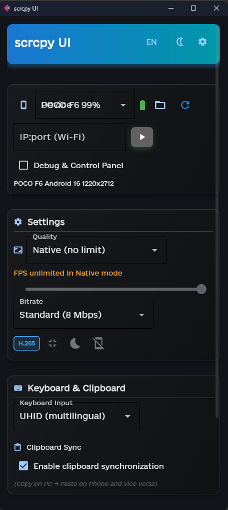
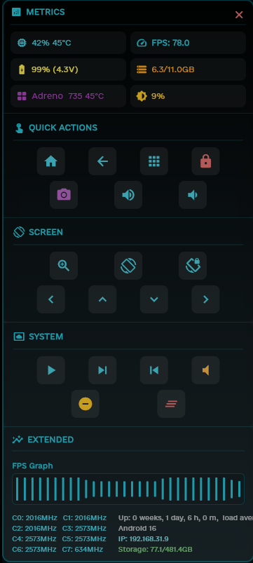
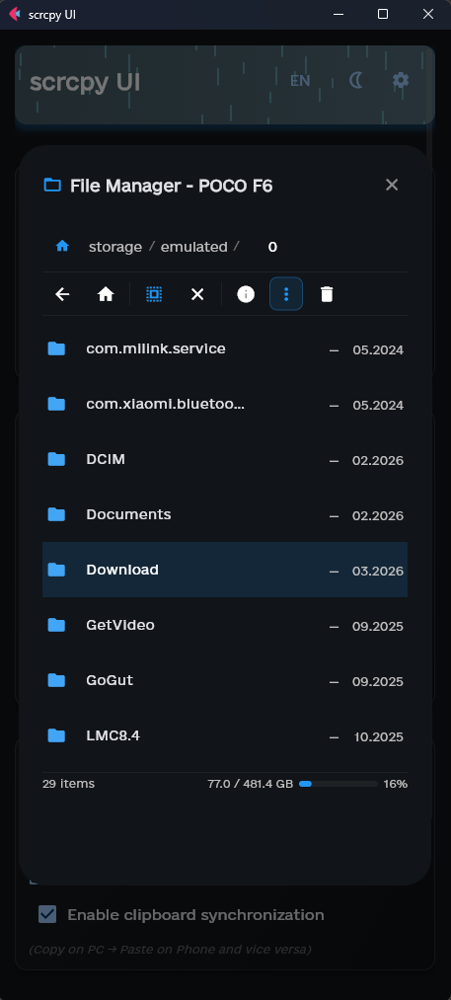

# scrcpy UI

> A modern, feature-rich graphical interface for [scrcpy](https://github.com/Genymobile/scrcpy) — the open-source Android screen mirroring tool.

Built with [Flet](https://flet.dev/) (Python + Flutter), featuring animated header, Wi-Fi device discovery, file manager, and localization support.

---

## 📸 Screenshots

<p align="center">
  
  
  
</p>

---

## ✨ Features

- 📱 **USB & Wi-Fi device connection** with Smart Auto-Discovery (mDNS + ping sweep)
- 🎛️ **Full scrcpy control** — resolution, FPS, bitrate, orientation, and more
- 📂 **Built-in File Manager** for pushing/pulling files to Android
- 🌦️ **Animated header** — sky gradient, stars, and rain that change with time of day
- 🌍 **Localization support** — easily extendable language files
- 🪲 **Debug & Control Panel** — live metrics (CPU, GPU, FPS graph, RAM) and quick actions
- 🔋 Battery status indicator per device

---

## 📋 Requirements

### Python dependencies

```
pip install -r requirements.txt
```

| Package    | Version  | Purpose                           |
|------------|----------|-----------------------------------|
| `flet`     | 0.24.1   | UI framework (Python + Flutter)   |
| `zeroconf` | 0.148.0  | mDNS-based Wi-Fi device discovery |
| `psutil`   | 7.1.0    | System/process information        |

### System dependencies

| Tool     | Description                                           | Install |
|----------|-------------------------------------------------------|---------|
| `scrcpy` | Android screen mirroring engine                       | [GitHub](https://github.com/Genymobile/scrcpy#get-the-app) |
| `adb`    | Android Debug Bridge (bundled with scrcpy on Windows) | —       |

> **Note:** Make sure `scrcpy` and `adb` are added to your system PATH after installation.

---

## 🔤 Font

The app uses the **e-Ukraine** font family, developed by the Ukrainian government.  
Place any `.ttf` or `.otf` font file inside the `data/` folder — the app will pick it up automatically.

👉 Download e-Ukraine: https://thedigital.gov.ua/fonts

> The font is **not included** in the repository due to licensing. Please download it separately.

---

## 🚀 Getting Started

```bash
# 1. Clone the repo
git clone https://github.com/Sfix0/scrcpy-UI.git
cd scrcpy-UI

# 2. Install Python dependencies
pip install -r requirements.txt

# 3. Make sure scrcpy and adb are in your PATH

# 4. (Optional) Place a .ttf/.otf font file into the data/ folder

# 5. Run
python scrcpy_ui.py
```

---

## 📁 Project Structure

```
scrcpy-UI/
├── scrcpy_ui.py       # Main application entry point
├── header.py          # Animated sky/stars/rain header
├── file_manager.py    # Android file manager UI
├── dialogs.py         # Reusable dialog components
├── localization.py    # Translations, settings, ADB helpers
├── debug_mod.py       # Debug panel (subprocess window)
├── data/              # Runtime assets
│   ├── language.json  # UI translations
│   ├── help.md        # In-app help content
│   └── *.otf / *.ttf  # Custom font (not included, download separately)
├── screenshots/       # Screenshots for README
├── requirements.txt
└── LICENSE
```

---

## 🖥️ Platform Support

| Platform | Status           |
|----------|------------------|
| Windows  | ✅ Supported     |
| Linux    | ❌ Not supported |
| macOS    | ❌ Not supported |

---

## 📄 License

This project is licensed under the [MIT License](LICENSE).

---

## 🙏 Credits

- [scrcpy](https://github.com/Genymobile/scrcpy) by Genymobile
- [Flet](https://flet.dev/) — Python UI framework
- [e-Ukraine](https://thedigital.gov.ua/fonts) — font by the Ministry of Digital Transformation of Ukraine
